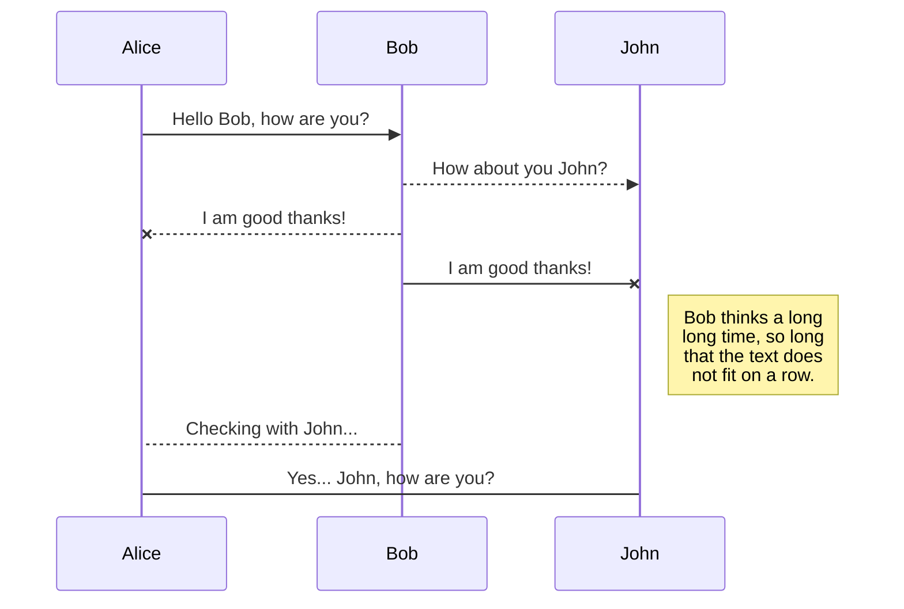
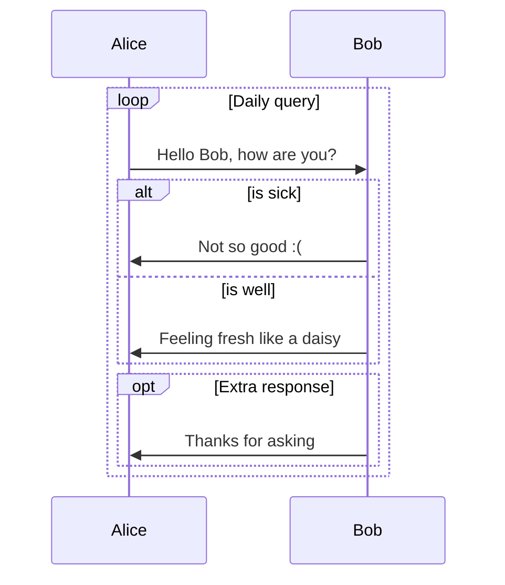
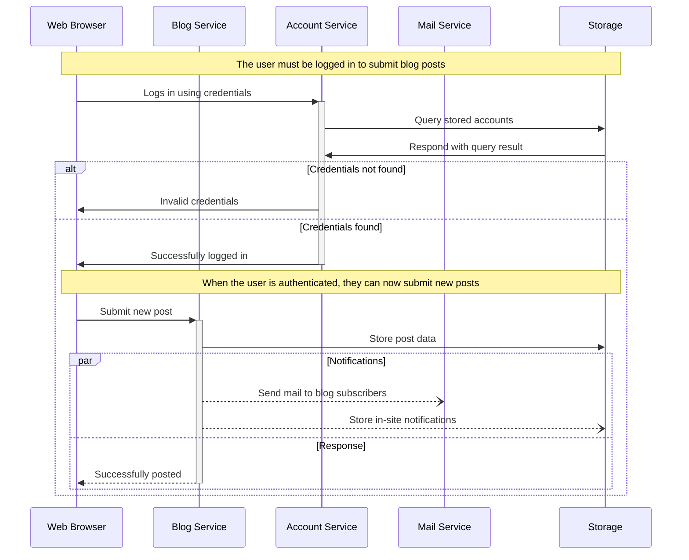

```mermaid
sequenceDiagram
    Alice ->> Bob: Hello Bob, how are you?
    Bob-->>John: How about you John?
    Bob--x Alice: I am good thanks!
    Bob-x John: I am good thanks!
    Note right of John: Bob thinks a long<br/>long time, so long<br/>that the text does<br/>not fit on a row.

    Bob-->Alice: Checking with John...
    Alice->John: Yes... John, how are you?
```

```mermaid
sequenceDiagram
    loop Daily query
        Alice->>Bob: Hello Bob, how are you?
        alt is sick
            Bob->>Alice: Not so good :(
        else is well
            Bob->>Alice: Feeling fresh like a daisy
        end

        opt Extra response
            Bob->>Alice: Thanks for asking
        end
    end
```

```mermaid
sequenceDiagram
    participant web as Web Browser
    participant blog as Blog Service
    participant account as Account Service
    participant mail as Mail Service
    participant db as Storage

    Note over web,db: The user must be logged in to submit blog posts
    web->>+account: Logs in using credentials
    account->>db: Query stored accounts
    db->>account: Respond with query result

    alt Credentials not found
        account->>web: Invalid credentials
    else Credentials found
        account->>-web: Successfully logged in

        Note over web,db: When the user is authenticated, they can now submit new posts
        web->>+blog: Submit new post
        blog->>db: Store post data

        par Notifications
            blog--)mail: Send mail to blog subscribers
            blog--)db: Store in-site notifications
        and Response
            blog-->>-web: Successfully posted
        end
    end
```